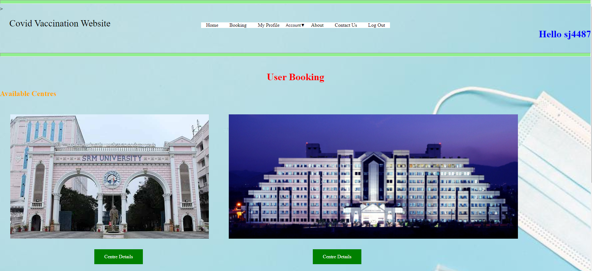
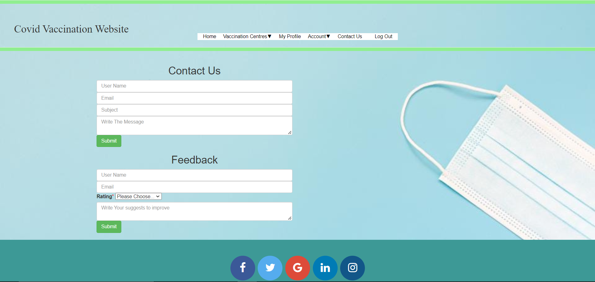

# Covid Vaccination

> This  Website acts as intermediate between people and vaccine centres 

####  How to use this website /Features:
* Admin/ user should create account
* Login with proper credentials
* Admin/User can view their profile
* Admin/User can update their password/delete account
* Admin can Add vaccination center / Remove vaccination center
* User can Book  slot

#### Used Languages are 
> * Html 
> * Css
> * Php
> * Mysql
> * JavaScript

#### Used tools are 
> * Xampp App           - For Detabase
> * Visual Studio Code  - Editor

#### How to run this  website on your local system:

* Install Xampp app and start Apache,Mysql Servers
* Set up database in Xampp -
    > Go to PhpMyAdmin 
    > Create a database
    > Go to import
    > Select covidvaccination.sql file present in MY Sql directory
    > Press enter So that all the data will be updated
* Now open your browser 
* Type localhost/{Your path to this directory}
* And then enjoy the site!!

### Sample Frontend

### Login Page:

### Admin Registration:

### User Registration:

### Home Page:

### Add Centres:

### Remove Centres:

### User Booking:

### Update Password:

### Admin Profile:

### Contact Us:
